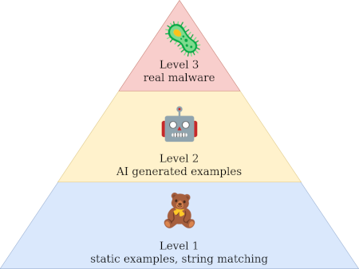

# YaraBench

A professional benchmark suite for evaluating Large Language Models' (LLMs) capability to generate YARA rules from textual descriptions of malware techniques and behaviors.

## Overview

YaraBench provides a standardized way to measure and compare LLM performance in the cybersecurity domain through three progressively challenging levels:



- **Level 1**: Static JSON challenges testing specific YARA rule capabilities
- **Level 2**: Dynamically generated synthetic challenges using LLM
- **Level 3**: Complex CTI report scenarios (planned)


## Features

- **Professional CLI**: Full-featured command-line interface with subcommands
- **Multiple Output Formats**: Terminal (Rich), JSON, and CSV exports
- **Robust YARA Parsing**: Advanced regex-based rule extraction with fallbacks
- **Comprehensive Evaluation**: Syntax validation, file matching, feature detection, and optional LLM judge
- **Multi-Model Support**: Compare multiple LLMs in a single run
- **Error Recovery**: Graceful handling of API failures and malformed rules
- **Extensible Architecture**: Pluggable evaluators and challenge levels

## Quick Start

### Installation

```bash
# Clone the repository
git clone https://github.com/ctitools/YaraBench.git
cd YaraBench

# Install dependencies (requires Python 3.11+)
pip install -r requirements.txt

# Set up API credentials
export OPENAI_API_KEY=your_openrouter_key
export OPENAI_BASE_URL=https://openrouter.ai/api/v1

# Download additional challenges from HuggingFace (optional)
export HF_TOKEN=your_huggingface_token
./yara-bench download
```

### Basic Usage

```bash
# Run benchmark on Level 1 challenges
./yara-bench run --model google/gemini-2.0-flash-001 --levels 1

# Run Level 2 synthetic challenges
./yara-bench run --model google/gemini-2.0-flash-001 --levels 2 --synthetic-count 5

# Combined Level 1 + Level 2 benchmark
./yara-bench run --model google/gemini-2.0-flash-001 --levels 1,2 --synthetic-count 3

# Compare multiple models
./yara-bench run --model google/gemini-2.0-flash-001 --model openai/gpt-4o-mini --levels 1

# Export results to JSON
./yara-bench run --model gpt-4o --levels 1 --output json --output-file results.json

# Use LLM as a judge for comprehensive evaluation
./yara-bench run --model google/gemini-2.0-flash-001 --levels 1 --judge openai/gpt-4o

# List available challenges
./yara-bench list --level 1

# Get random challenges for manual testing
./yara-bench get --levels 1 --num-samples 1

# Validate challenge files
./yara-bench validate --level 1
```

## Challenge Levels

### Level 1: Static Challenges 
Pre-defined JSON challenges with known test cases:
- Ransomware detection (file extensions, encryption strings)
- Backdoor communication (C2 domains, ports)
- PE analysis (UPX packing, system calls)
- Registry persistence (Run keys, startup modification)
- Non-actionable scenarios (behavior-based detection)

**Note**: The repository includes demo challenges for development and testing. Additional production challenges are available via HuggingFace (see Challenge Distribution below).

### Level 2: Synthetic Challenges 
Dynamically generated using LLM with configurable complexity:
- Randomized malware behaviors using enhanced seed generation
- Variable IoCs and patterns extracted from descriptions  
- Base64-encoded test samples with matching/non-matching pairs
- Feature extraction and actionability detection

### Level 3: CTI Reports (Planned)
Full threat intelligence reports with real-world complexity

## Architecture

```
YaraBench/
├── src/                    # Core source code
│   ├── cli.py             # Click-based CLI interface
│   ├── benchmark.py       # Main orchestrator
│   ├── models/            # Pydantic data models
│   ├── levels/            # Challenge level implementations
│   ├── llm/               # OpenAI-compatible client + synthetic generation
│   ├── parsing/           # YARA rule extraction
│   ├── evaluation/        # Pluggable evaluators
│   ├── utils/             # Utility functions (SeedGenerator, etc.)
│   └── output/            # Multiple output formats
├── data/                  # Challenge definitions
│   └── level1/           # Static Level 1 challenges
├── tests/                # Comprehensive test suite
├── yara-bench*           # Executable CLI script
└── requirements.txt      # Dependencies
```

## Example Results

```
                        Benchmark Summary                         
┏━━━━━━━━━━━━━━━━━━━━━━━━━━━━━┳━━━━━━━┳━━━━━━━┳━━━━━━━┳━━━━━━━━━━┓
┃ Model                       ┃ Total ┃ Valid ┃ Score ┃ Time (s) ┃
┡━━━━━━━━━━━━━━━━━━━━━━━━━━━━━╇━━━━━━━╇━━━━━━━╇━━━━━━━╇━━━━━━━━━━┩
│ google/gemini-2.0-flash-001 │     5 │     4 │  0.80 │      8.8 │
│ openai/gpt-4o-mini          │     5 │     4 │  0.80 │     12.0 │
└─────────────────────────────┴───────┴───────┴───────┴──────────┘
```

## Configuration

### Environment Variables
```bash
OPENAI_API_KEY=sk-...              # Your OpenRouter API key
OPENAI_BASE_URL=https://...        # API endpoint (OpenRouter/OpenAI/etc.)
JUDGE_MODEL_API_KEY=sk-...         # Optional LLM judge API key
HF_TOKEN=hf_...                    # HuggingFace token for downloading additional challenges
```

### Supported Models
- Any OpenAI-compatible model

## Evaluation Metrics

YaraBench uses a weighted scoring system:

### Without LLM Judge:
- **Syntax Validation** (30%): YARA compilation success
- **Feature Coverage** (20%): Expected strings found
- **Keyword Usage** (10%): YARA features utilized  
- **File Matching** (40%): Correct true/false positives

### With LLM Judge (--judge option):
- **Syntax Validation** (20%): YARA compilation success
- **Feature Coverage** (15%): Expected strings found
- **Keyword Usage** (10%): YARA features utilized  
- **File Matching** (35%): Correct true/false positives
- **LLM Judge** (20%): Comprehensive quality assessment including:
  - Correctness: Rule implements requirements accurately
  - Completeness: All required elements present
  - Efficiency: Optimized rule structure
  - Best Practices: Follows YARA conventions
  - False Positive Risk: Likelihood of incorrect matches

## Challenge Distribution

YaraBench uses a dual-repository approach to protect benchmark integrity:

### GitHub Repository (Public)
- **URL**: https://github.com/ctitools/YaraBench
- **Contents**: 
  - Complete source code and documentation
  - Demo challenges for development/testing
  - Directory structure with `.keep` files
- **Purpose**: Code review, contributions, and basic testing

### HuggingFace Dataset (Gated)
- **URL**: https://huggingface.co/datasets/ctitools/YaraBench
- **Access**: Requires HuggingFace account and access approval
- **Contents**: Full challenge set for benchmarking
- **Integration**: Downloaded challenges overlay demo challenges with `_hf_` prefix

### Downloading Additional Challenges
```bash
# Set your HuggingFace token
export HF_TOKEN=your_huggingface_token

# Download challenges (overlays on existing demo challenges)
./yara-bench download

# Force re-download
./yara-bench download --force

# Use custom repository
./yara-bench download --repo-id your-org/your-dataset
```

The download command seamlessly integrates HuggingFace challenges with the demo challenges, allowing the benchmark to work out-of-the-box while providing access to the full challenge set for serious evaluation.

## Contributing

We welcome contributions! These are currently most needed for:
- Additional challenge levels
- More diverse and realistic scenarios
- Helping us flesh out level 3

## License

MIT License - see LICENSE file for details.