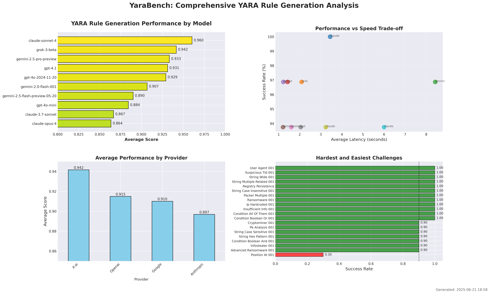

# YaraBench Model Performance Analysis Report

*Generated: 2025-06-21 18:58 UTC*

## Executive Summary

This report analyzes the performance of **10 AI models** in generating YARA rules across **32 different security challenges**. The evaluation covers various aspects of YARA rule generation including syntax validity, detection accuracy, and generation speed.

### Key Findings

- **Best Performing Model**: anthropic/claude-sonnet-4 with an average score of **0.960**
- **Overall Success Rate**: 95.6% across all models
- **Fastest Model**: google/gemini-2.0-flash-001 with 1208ms average latency
- **Most Consistent**: anthropic/claude-sonnet-4 with 25 perfect scores

## Model Performance Leaderboard

| Rank | Model | Provider | Avg Score | Success Rate | Perfect Scores | Syntax Errors | Avg Latency |
|------|-------|----------|-----------|--------------|----------------|---------------|-------------|
| 3 | **claude-sonnet-4** | Anthropic | 0.960 | 100.0% | 25 | 0 | 3445ms |
| 10 | **grok-3-beta** | X-ai | 0.942 | 96.9% | 27 | 1 | 2089ms |
| 6 | **gemini-2.5-pro-preview** | Google | 0.933 | 96.9% | 24 | 1 | 8429ms |
| 7 | **gpt-4.1** | Openai | 0.931 | 96.9% | 25 | 1 | 1427ms |
| 8 | **gpt-4o-2024-11-20** | Openai | 0.929 | 96.9% | 23 | 1 | 1227ms |
| 4 | **gemini-2.0-flash-001** | Google | 0.907 | 93.8% | 24 | 2 | 1208ms |
| 5 | **gemini-2.5-flash-preview-05-20** | Google | 0.890 | 93.8% | 21 | 2 | 1603ms |
| 9 | **gpt-4o-mini** | Openai | 0.884 | 93.8% | 21 | 2 | 2048ms |
| 1 | **claude-3.7-sonnet** | Anthropic | 0.867 | 93.8% | 20 | 2 | 3238ms |
| 2 | **claude-opus-4** | Anthropic | 0.864 | 93.8% | 17 | 2 | 6003ms |

## Performance by Provider

| Provider | Models | Avg Score | Avg Success Rate | Avg Latency |
|----------|--------|-----------|------------------|-------------|
| X-ai | 1 | 0.942 | 96.9% | 2089ms |
| Openai | 3 | 0.915 | 95.8% | 1567ms |
| Google | 3 | 0.910 | 94.8% | 3747ms |
| Anthropic | 3 | 0.897 | 95.8% | 4229ms |

## Challenge Analysis

### Most Difficult Challenges
| Challenge | Success Rate | Avg Score | Std Dev |
|-----------|--------------|-----------|---------|
| Position At 001 | 30.0% | 0.260 | 0.397 |
| Advanced Ransomware 001 | 90.0% | 0.830 | 0.258 |
| Condition Boolean And 001 | 90.0% | 0.900 | 0.300 |
| Cryptominer 001 | 90.0% | 0.910 | 0.270 |
| Infostealer 001 | 90.0% | 0.883 | 0.266 |

### Easiest Challenges
| Challenge | Success Rate | Avg Score | Std Dev |
|-----------|--------------|-----------|---------|
| String Case Insensitive 001 | 100.0% | 1.000 | 0.000 |
| String Multiple Related 001 | 100.0% | 0.947 | 0.065 |
| String Wide 001 | 100.0% | 0.910 | 0.113 |
| Suspicious Tld 001 | 100.0% | 1.000 | 0.000 |
| User Agent 001 | 100.0% | 0.967 | 0.073 |

## Model-Specific Insights

### Top Performers Analysis

#### 1. anthropic/claude-sonnet-4
- **Average Score**: 0.960
- **Strengths**: Perfect scores in 25 challenges
- **Processing Speed**: 3445ms average latency
- **Reliability**: 0 syntax errors out of 32 challenges

#### 2. x-ai/grok-3-beta
- **Average Score**: 0.942
- **Strengths**: Perfect scores in 27 challenges
- **Processing Speed**: 2089ms average latency
- **Reliability**: 1 syntax errors out of 32 challenges

#### 3. google/gemini-2.5-pro-preview
- **Average Score**: 0.933
- **Strengths**: Perfect scores in 24 challenges
- **Processing Speed**: 8429ms average latency
- **Reliability**: 1 syntax errors out of 32 challenges

## Methodology

The evaluation tested each model's ability to generate YARA rules for various security scenarios including:
- Ransomware detection
- Anti-VM/sandbox evasion techniques
- Information stealers
- Backdoor detection
- Cryptominers
- Various obfuscation techniques

Each rule was evaluated on:
1. **Syntax Validity**: Whether the generated YARA rule compiles successfully
2. **Detection Accuracy**: Whether the rule correctly identifies malicious samples while avoiding false positives
3. **Expected Elements**: Presence of required strings and keywords
4. **Generation Speed**: Time taken to generate the rule

## Recommendations

Based on this analysis:

1. **For Production Use**: Consider {df.iloc[0]['Full Name']} for highest accuracy
2. **For Speed-Critical Applications**: Use {df.loc[df['Avg Latency (ms)'].idxmin(), 'Full Name']}
3. **For Balanced Performance**: {df.iloc[1]['Full Name']} offers good accuracy with reasonable speed

## Visualization

---

*This report was automatically generated from YaraBench evaluation data.*
